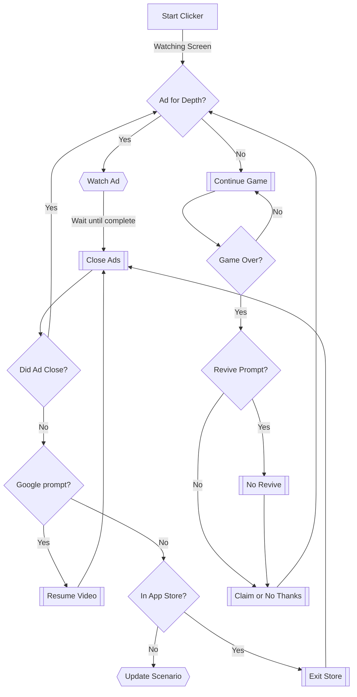

# Thanks for visisting the Neighborhood!

## Game Guide for Caesars Slots

Please download the above zip file and upload to Smart AutoClicker.

Once scenarios are verified, start the script for Caesars Slots.

_DISCLAIMER: This AutoClick pattern was programmed on a Google Pixel 6.
Therefore, the location of the images may not be in the same location. 
Ensure that you go through the scenarios below by hand at least once before activating the AutoClicker._

## Scenario Walkthrough

Scenarios are based on what is currently seen on your device's screen. Therefore, you can make decisions based on certain things that are present (or not) on your screen.

Scenarios are executed from top to bottom. In this way, they act as logic gates based on what is currently seen on the screen.

Our goal in Caesars Slots is to reach a specific player level. The only way to reach the next level is to gain XP by playing the game for a set bet amount. The higher your bet amount, the more XP you will earn per spin. 

As such, it is recommended that you betbetween 0.5% and 1.5% of your account size at all times. 

$BetSize = 0.5\% \le AccountSize \le 1.5\%$

You should also take advantage of the x2, x3, or x4 XP offers available to purchase. This will allow you to reach the next levels faster while still conserving the approriate risk levels.

So:

### $Level_i = i,$ where $i \in \mathbb{N}_1$ and $i \in \int_1^{\infty} f(x)dx + f(y)dy$  

## $f(x) = TotalXP_{x-1},$ where $x \in \mathbb{N}_1$  

## $f(y) = f(x) + \frac{(BetSize_y \times XPBonus)}{NextLevelXP_y}$  

Note that $TotalXP$ is $\sum_{x=1}^\infty NextLeveXP_x$ and $NextLeveXP$ is calculated within Caesars Slots.

To my knowledge, there is no current table that contains the XP required to reach the next level.

**Our advantage is that we can auto spin slots and automatically play bonus games if necessary.**

In summary, our bot will play the slot games 24/7 and adjust the bet size accordingly using OpenCV.

### Here are our scenarios:

---

#### 1. Ad for Depth
    If an 'AD' button appears on the depth upgrade, click on the button to watch an ad.

#### 2. No Revive
    If you 'fail' and the 'Revive' prompt appears, click outside the prompt to continue the game.

#### 3. Claim or No Thanks
    If there is a prompt to click 'Claim' or 'No Thanks', click the prompt. 
    
#### 4. Continue game
    If there is no Ad for Depth, continue playing the game.

#### 5. Resume Video
    If we attempt to close an ad and are met with a 'Resume or Skip' prompt:
        1. Resume the video.
        2. Wait 15 seconds before trying to close the ad again.

#### 6. Close Ads
    If we are watching an ad, attempt to close the ad once the timer has expired.

#### 7. Exit Store
    If our bot attempts to close ad and it opens the app store instead:
        1. Press back button to return to app store main screen.
        2. Swipe left-to-right on screen to return to the ad before trying to close the ad again.

#### Flowchart:

Please add additional screenshots and scenarios as needed. For example, the 'Close Ads' scenario will need to be updated as new ads are introduced to the game.

We did our best to capture various ad exit symbols but add more as you monitor the AutoClicker.

**Please monitor your AutoClicker.** There may be unexpected results if left unattended for long periods. 
