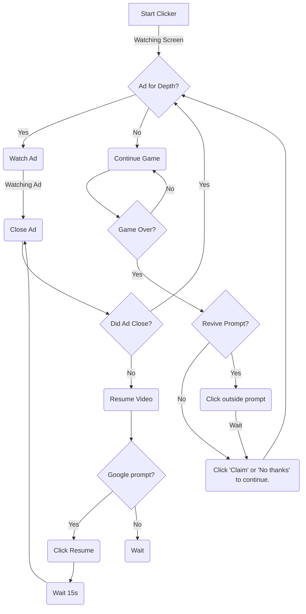

# Thanks for visisting the Neighborhood!

## Game Guide for CryptoMagnet

Please download the above zip file and upload to Smart AutoClicker.

Once scenarios are verified, start the script for CryptoMagnet.

_DISCLAIMER: This AutoClick pattern was programmed on a Google Pixel 6.
Therefore, the location of the images may not be in the same location. 
Ensure that you go through the scenarios below by hand at least once before activating the AutoClicker._

## Scenario Walkthrough

Scenarios are based on what is currently seen on your device's screen. Therefore, you can make decisions based on certain things that are present (or not) on your screen.

Scenarios are executed from top to bottom. In this way, they act as logic gates based on what is currently seen on the screen.

Our goal in CryptoMagent is to reach 10,000 (10K) meters. However, once you reach a certain depth, paying for one depth upgrade will cost you billions of dollars.

Our advantage is that we can watch ads for a free depth upgrade.

### Here are our scenarios:

---

#### 1. Ad for Depth
    If an 'AD' button appears on the depth upgrade, click on the button to watch an ad.

#### 2. No Revive
    If you 'fail' and the 'Revive' prompt appears, click outside the prompt to continue the game

#### 3. Continue game
    If there is no Ad for Depth, continue playing the game.

#### 4. Close Ads
    If we are watching an ad, attempt to close the ad once the timer has expired.

#### 5. Resume Video
    If we attempt to close an ad and are met with a 'Resume or Skip' prompt:
        1. Resume the video 
        2. Wait 15 seconds before trying to close the ad again.

#### Flowchart:

Please add additional screenshots and scenarios as needed. For example, the 'Close Ads' scenario will need to be updated as new ads are introduced to the game.

We did our best to capture various ad exit symbols but add more as you monitor the AutoClicker.

**Please monitor your AutoClicker.** There may be unexpected results if left unattended for long periods. 
